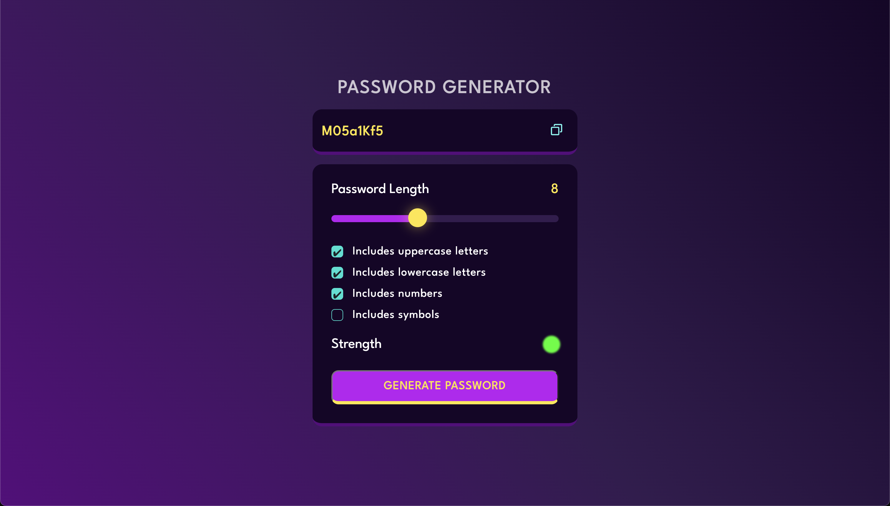

# Password Generator

A simple and customizable password generator web application.

## Table of Contents

- [About](#about)
- [Features](#features)
- [Demo](#demo)
- [Getting Started](#getting-started)
- [How to Use](#how-to-use)
- [Contributing](#contributing)

## About

The Password Generator is a web-based tool that allows you to generate strong and secure passwords based on your criteria. It provides options for password length and allows you to choose whether to include uppercase letters, lowercase letters, numbers, and symbols in the generated password.

## Features

- Customize password length.
- Choose to include uppercase letters, lowercase letters, numbers, and symbols.
- Visual password strength indicator.
- Copy password to the clipboard.
- Responsive and user-friendly interface.

## Demo

You can try out the Password Generator by visiting the [demo page](https://naman-password-generator.netlify.app/).

## Getting Started

To get a copy of the project up and running on your local machine, follow these steps:

1. Clone the repository to your local machine: `git clone https://github.com/NamanAnand13/Password-Generator.git`

2. Open the project folder: `cd password-generator`

3. Open the `index.html` file in your web browser.

## How to Use

1. Set the desired password length using the slider.
2. Select the options you want for your password (uppercase letters, lowercase letters, numbers, symbols).
3. Click the "Generate Password" button to generate a password.
4. Your generated password will appear in the text input box.
5. Click the "Copy" button to copy the password to your clipboard.

## Contributing

Contributions are welcome! If you have any suggestions, bug reports, or feature requests, please open an issue or create a pull request.

To contribute to this project:

1. Fork the repository.
2. Create your feature branch: `git checkout -b feature/your-feature`

3. Commit your changes: `git commit -m 'Add some feature'`

4. Push to the branch: `git push origin feature/your-feature`

5. Create a pull request.

---

Feel free to modify and expand this README template to provide more details about your specific project. Including information about project dependencies, installation instructions, and any additional features or customization options would be beneficial for potential users and contributors.